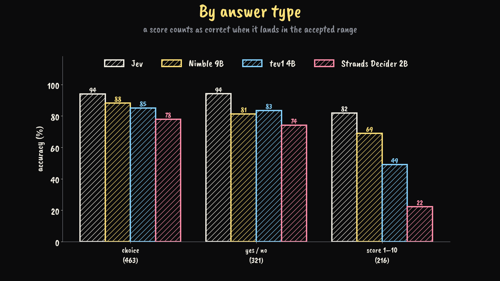
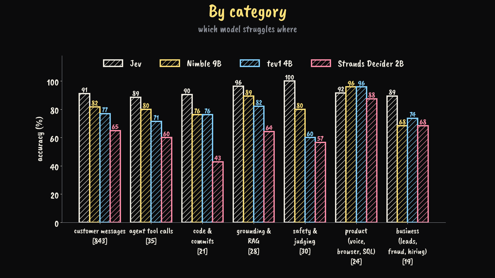
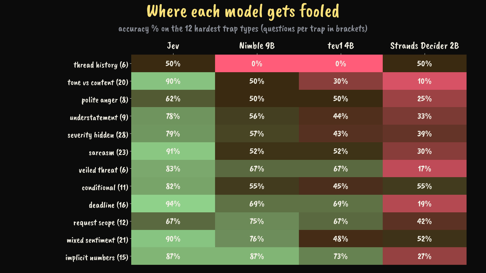
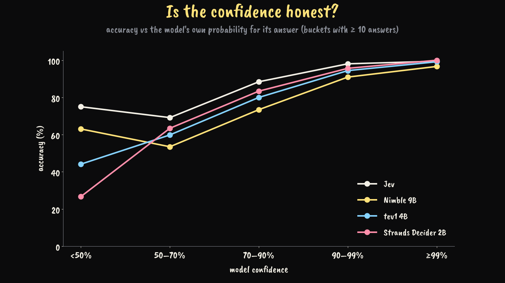

# Can you fool Jev?

1000 English trick questions, sent as **identical `/v1/systemone` JSON requests** to four decision models:

| model | how it runs | version used |
|---|---|---|
| **Jev** (TypeSafe) | hosted API, `api.typesafe.ai` | `jev-latest` (jev-1.13.0) |
| **Nimble 9B** (Bespoke Labs) | local, Ollama 0.35 | `nimble:latest` (9b953de7a533) |
| **tev1 4B** (Together AI) | local, Ollama 0.35 | `tev1:4b` (9b5bb969e46c) |
| **Strands Decider 2B** | local, `strands-decider serve` | strands-decider 0.1.0, `StrandsAgents/strands-decider-2B-hobson-v19` |

Run on 2026-10-02. The local models ran one at a time on one Apple-silicon Mac. Only the `model` field differs between runs, and every request body that was sent is in `results/requests-*.jsonl`.

📺 Video walkthrough: [I Tried to Fool 4 AI Decision Models With 1000 Trick Questions](https://www.youtube.com/watch?v=3O2gIeTrn9g)

## Results

```
model        answered  accuracy  sure & wrong  median ms
Jev              1000     91.4%             7        275
Nimble 9B        1000     81.8%            36        400
tev1 4B          1000     76.8%            19        220
Strands 2B       1000     64.7%             4         77
```

*sure & wrong* = wrong answers the model gave with ≥ 90% probability. Jev's latency includes the network round trip; the others are local.

| answer type | n | Jev | Nimble 9B | tev1 4B | Strands 2B |
|---|---|---|---|---|---|
| choice (≤ 10 options) | 463 | 94% | 88% | 85% | 78% |
| yes / no | 321 | 94% | 81% | 83% | 74% |
| score 1–10 (must land in the accepted range) | 216 | 82% | 69% | 49% | 22% |

| category | n | Jev | Nimble 9B | tev1 4B | Strands 2B |
|---|---|---|---|---|---|
| customer messages | 843 | 91.1% | 81.7% | 77.0% | 65.0% |
| agent tool calls | 35 | 88.6% | 80.0% | 71.4% | 60.0% |
| code & commits | 21 | 90.5% | 76.2% | 76.2% | 42.9% |
| grounding & RAG | 28 | 96.4% | 89.3% | 82.1% | 64.3% |
| safety & judging | 30 | 100% | 80.0% | 60.0% | 56.7% |
| product (voice, browser, SQL) | 24 | 91.7% | 95.8% | 95.8% | 87.5% |
| business (leads, fraud, hiring) | 19 | 89.5% | 68.4% | 73.7% | 68.4% |

The new categories have only 19–35 questions each, so one question moves a bar by 3–5 points. Read them as a direction, not a ranking.






## The dataset

`data/questions.csv`, one row per question:

| column | meaning |
|---|---|
| `id` | stable id (gaps are rows removed from an earlier draft) |
| `category` | customer messages, agent tool calls, code & commits, … |
| `type` | `choice`, `yes_no` or `score` |
| `input` | the text being judged (the `state` in the request) |
| `question` | the question; yes/no questions define both answers as `yes = …; no = …` |
| `options` | choice options separated by `\|`, `yes\|no`, or `1-10` |
| `expected` | the expected answer |
| `accept` | for scores: the accepted range, e.g. `7-9` |
| `trap` | what the question tries to trick the model with (sarcasm, severity_hidden, prompt_injection, …) |
| `why` | one line on why the expected answer is right |

Every question has a trap. Some are easy controls (`control_easy`).

**About the labels:** I wrote the questions and the labels myself. `data/debatable_labels.json` lists 42 labels I consider debatable, with the reason. If you disagree with a label, open an issue.

## How a row becomes a request

```json
{
  "model": "jev-latest",
  "state": "<input>",
  "questions": {
    "q": { "type": "choice", "instructions": "<question>", "criteria": {"angry": "", "happy": "", "neutral": ""} }
  }
}
```

- `yes_no` → `"type": "noul"` with `"criteria": {"true": "<yes definition>", "false": "<no definition>"}`; answer = `noul ≥ 0.5`
- `score` → `"type": "score"` with `"criteria": ["1", …, "10"]`; answer = the probability-weighted `score`, rounded, mapped through `legend`

`examples/request.json` asks all three types in one request.

## Run it yourself

```bash
# Ollama models
ollama pull nimble && ollama pull tev1:4b
python3 scripts/run_systemone.py nimble
python3 scripts/run_systemone.py tev1:4b

# Strands Decider
python3 -m venv .venv-strands && .venv-strands/bin/pip install strands-decider
./scripts/run_strands.sh                       # DEVICE=cuda|cpu on non-Apple machines

# Jev (needs an API key)
SYSTEMONE_HOST=https://api.typesafe.ai SYSTEMONE_KEY=$JEV_API_KEY python3 scripts/run_systemone.py jev-latest

# any other model behind a /v1/systemone endpoint
SYSTEMONE_HOST=http://localhost:9000 python3 scripts/run_systemone.py my-model

python3 scripts/summary.py
python3 scripts/charts_v3.py                   # CHART_FONT=path/to/CaveatBrush-Regular.ttf for the hand-drawn look
```

Runs are resumable: rows that already exist in `results/<model>.jsonl` are skipped. Delete the file to start over.

Try one request by hand:

```bash
jq '.model="nimble"' examples/request.json | curl -s localhost:11434/v1/systemone \
  -H 'Content-Type: application/json' -d @- | jq .answers
```

## Result files

`results/<model>.jsonl`, one line per question:
`id, type, trap, expected, accept, answer, correct, probs, p_answer, p_expected, api_confidence, ms, error`, plus `score_raw` and `argmax` for scores.

## Limitations

- **Not a benchmark.** 1000 questions, written and labeled by one person. Some labels are debatable.
- Each model ran **once, with default settings**. No prompt tuning per model.
- Most questions (843) are customer messages, so the overall number is mostly about that domain.
- Accuracy depends on how criteria are phrased; I used the same phrasing for every model.
- Jev latency includes the network round trip; local latency depends on my machine.
- After `ollama pull nimble` updated the local Nimble to a new build, I re-ran all 1000 questions: the answers were identical to the earlier build.

What it *is* good for: every model saw exactly the same 1000 requests, so it shows where each model breaks, and how sure it is when it does.

## License

Code: MIT (see `LICENSE`). Dataset (`data/`) and results (`results/`): [CC BY 4.0](https://creativecommons.org/licenses/by/4.0/).
